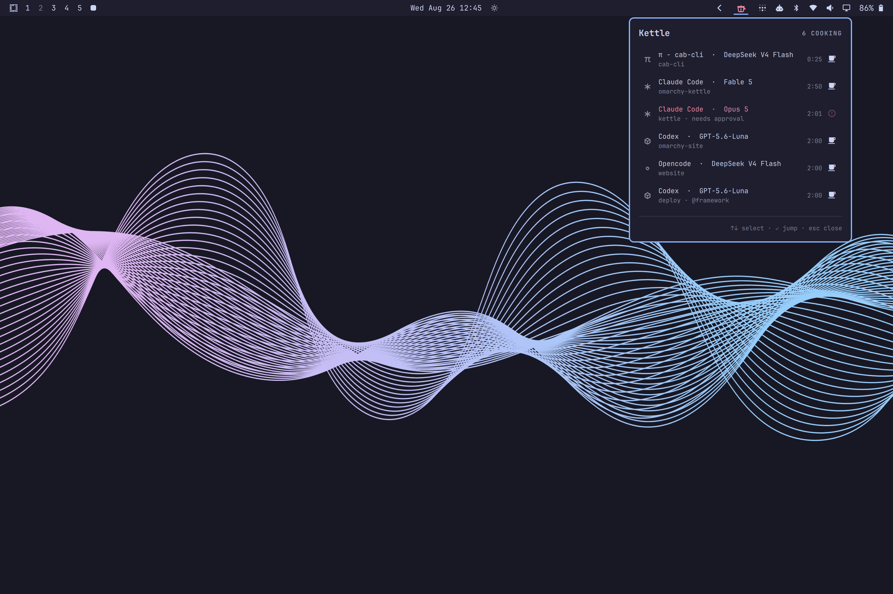

# Kettle

Long-running agent work as simmering pots on your Omarchy bar. Glance to see
what's cooking; get told when something finishes, fails, or needs you. Click a
pot to land in the terminal it's running in.



Six sessions above, from four sources: a herdr pane, hook-driven sessions,
one posted by `kettle-emit`, and one arriving through the ssh relay — each
naming its model from its agent's own catalog.

Kettle knows about **herdr** sessions — which covers every agent herdr tracks,
including Pi — plus agents with hook systems running in plain terminal
windows outside any multiplexer, and sessions on remote hosts over ssh.

Six CLIs have hook systems Kettle installs into: **Claude Code**, **Codex**,
**Qwen Code**, **Gemini CLI**, **Factory droid**, and **Grok Build**. Pi has
none, so Pi is visible **through herdr only**; anything else can post its own
events (see [Any other agent](#any-other-agent)).

## Why

Agent sessions are long, bursty, and easy to lose track of. You kick one off,
switch workspace, and either forget it or compulsively tab back to check. Worse,
an agent blocked on a permission prompt waits indefinitely while you do
something else.

The state that matters is *finished while you weren't looking* and *waiting on
you right now*. Kettle surfaces exactly those.

## States

| State | Meaning | Ticking clock? |
|---|---|---|
| `simmering` | work in progress | yes — the tick is the signal |
| `needs-attention` | blocked on an approval or question | yes — it's measuring **your** latency |
| `ready` | finished, and you haven't looked yet | no |
| `murky` | agent present but unclassifiable | never shown on the bar |

There is no reachable failure state. herdr reports only
idle/working/blocked/done/unknown, and neither agent's hooks carry an exit
status, so nothing can currently tell Kettle that a run *failed* as opposed to
finished. Saying otherwise would be a promise the data cannot keep. A `burnt`
state is reserved in the code for future shell-command pots — those do report
exit codes — and where `burnt` appears below, that reservation is what is
being described.

A finished pot never ticks. A running counter on something that already stopped
reads as "still going", so terminal states show a coarse "just now / 5m ago"
plus how long the run actually took.

### Colours

Omarchy themes expose five palette roles — `foreground`, `background`, `accent`,
`urgent`, `muted` — and there is no success or warning role. So state is carried
by **glyph first, colour second**: `needs-attention` and `burnt` necessarily
share `urgent` and are told apart by shape and by motion (only
`needs-attention` pulses). That also survives colourblindness, a monochrome
theme, and a 15-pixel bar slot.

## Install

```bash
omarchy plugin add https://github.com/zzwong/omarchy-kettle.git --enable
~/.config/omarchy/plugins/zzwong.kettle/bin/kettle-install
```

`omarchy plugin add` clones the repo into
`~/.config/omarchy/plugins/zzwong.kettle/`, validates the manifest, and
enables the widget (it defaults to the right bar section). Updating later is
`omarchy plugin update zzwong.kettle`, which shows a diff before
fast-forwarding; removal is `omarchy plugin remove zzwong.kettle`.

The second line is deliberately separate: Omarchy's installer never executes
plugin code, so anything that touches files outside the plugin directory has
to be a step you run yourself. `kettle-install` merges hook entries into the
config of every supported CLI it finds — Claude Code, Codex, Qwen Code,
Gemini CLI, Factory droid, Grok Build — each in its own dialect (Qwen and
Gemini count timeouts in milliseconds, droid nests nothing, Grok reads a
directory so Kettle owns a whole file there), pointing at wherever the repo
lives. It is idempotent, preserves your existing hooks and settings, and
`--remove` reverses it cleanly — run it before `omarchy plugin remove`, which
deletes the scripts the hooks point at. `--check` reports status without
changing anything.

herdr needs no setup — Kettle polls it directly. Without `kettle-install` the
herdr side works fully; only sessions outside herdr go unseen.

## How each source works

**herdr** — polled via `herdr api snapshot` every 2s (backing off to 15s when no
server is running, and waking instantly when the socket reappears). One call
returns every agent, so N sessions cost one process.

A herdr pot is named by, in order: the name you gave it with
`herdr agent rename`, the agent's own terminal title (Claude Code sets this to
a live summary of what it is doing), then the bare agent name. All three ride
the snapshot Kettle already fetches — naming costs nothing extra, locally or
over the remote stream. herdr already distinguishes
`idle` from `done`, where `done` means *finished while its tab was unseen* —
which is precisely the state this widget exists to show. Clicking a herdr pot
focuses its tab, which flips it to `idle`, which clears the pot on the next
poll. The jump **is** the acknowledgement.

**Hook-driven agents** (Claude Code, Codex, Qwen Code, Gemini CLI, Factory
droid, Grok Build) — the agent reports its own lifecycle through hooks.
Nothing outside a terminal can observe what happens inside one: OSC escape
sequences flow from the process to the terminal emulator and stop there, with no
bus and no way for a third party to subscribe. The agent telling you directly is
the only honest source of state.

The six dialects were verified against each tool's source or official docs,
not by analogy: Gemini renamed the prompt/turn events to
`BeforeAgent`/`AfterAgent`; Qwen and droid say *why* they notified
(`notification_type`), which outranks guessing from message text; Grok speaks
camelCase, documents no Notification payload — so it is left unwired and a
permission wait stays `simmering` rather than turning falsely `ready` — and
identifies itself only through `GROK_*` environment variables, since every
one of these tools sets `CLAUDE_PROJECT_DIR` as a compatibility alias and it
therefore proves nothing.

## Any other agent

Two paths, neither of which requires changing Kettle.

**Inside herdr, it already works.** herdr detects some twenty agent TUIs —
opencode, gemini, amp, grok, hermes, cursor, and more — and Kettle renders
whatever herdr reports. Most known agents get a hand-drawn identity mark
(simplified line reductions of each brand, legible at 14 px); anything else
gets its initial in a ring — identifiable, never a wrong logo.

**Outside herdr, the ingestion is a public contract.** Kettle ships hooks
for the six CLIs that have hook systems to install into; anything else —
opencode and Amp (JS plugin systems rather than event→command config), goose
(no lifecycle hooks at all), Cursor CLI (hooks documented but currently not
fired by `cursor-agent`) — integrates by posting its own lifecycle events
with `bin/kettle-emit` from whatever extension point the tool offers (a
plugin, a wrapper, a shell alias):

```bash
kettle-emit --agent opencode --id "$SESSION" --state working  --cwd "$PWD"
kettle-emit --agent opencode --id "$SESSION" --state blocked  --message "needs approval"
kettle-emit --agent opencode --id "$SESSION" --state finished --model some-model
kettle-emit --agent opencode --id "$SESSION" --state gone
```

States are `register | working | blocked | finished | gone`. `--window`
takes a Hyprland window address and becomes the pot's jump target; without
it the pot is informational. On a host set up by `kettle-remote install`,
the same command posts through the ssh relay instead — the script detects
which side it is on. Model slugs are resolved against the agent catalogs
described under [Model](#model), so `--model deepseek-v4-flash` renders as
its proper display name.

## Jumping to a window

Clicking a pot has to find the right window, which is harder than it sounds.

For herdr, `herdr agent focus <pane>` switches herdr's *internal* tab but does
not raise the OS window, so Kettle follows it with a Hyprland dispatch.

For agent sessions, Kettle uses a trick: OSC 2 (set window title) is the one
escape sequence with an externally visible side effect, because the terminal
republishes the title to the compositor. At session start the hook writes a
nonce title, polls `hyprctl clients` until it appears (~50ms), caches the window
address, and lets the agent repaint its title immediately after.

This matters because single-process terminals — `ghostty --gtk-single-instance`,
`foot --server`, kitty single-instance — report **the same PID for every
window**, so walking the process tree cannot tell them apart. The nonce works
regardless.

### `herdrWindow`

herdr sets no window title of its own, so on a single-process terminal there is
no way to identify its window automatically. Set a title substring:

```json
{ "id": "zzwong.kettle", "herdrWindow": "herdr" }
```

and launch herdr with a matching title, e.g. `ghostty --title=herdr -e herdr`.
On multi-process terminals Kettle finds it automatically and you can leave this
unset.

## Model

Each pot names the model beside the agent — `Claude Code · Opus 5`.

Where it comes from differs by agent, because the hook systems disagree:
Codex and Qwen Code put `model` in the hook payload; Claude Code does not, so
the hook seeks the last 256 KB of the session transcript (these files reach
megabytes) and reads the newest assistant message. Gemini, droid and Grok
carry no model in payload or readable transcript, so their pots go without —
no number is better than a guessed one.

Display names are resolved the way pi resolves models: agents already
maintain model catalogs on disk — Codex refreshes `~/.codex/models_cache.json`,
pi caches `~/.pi/agent/models-store.json` — so slugs are looked up there,
preferring the emitting agent's own catalog when they disagree about the same
slug. The catalogs are watched files, so a newly released model gets its
proper name the moment the agent itself learns it exists, with no process
spawned and nothing hardcoded. A capitalisation heuristic covers slugs no
catalog knows. Remote sessions carry the
string over the relay, where it is length-capped and character-stripped —
it is self-reported and cosmetic, unlike host and window, which the relay
always derives itself.

There is deliberately **no context-usage readout**. The transcript exposes no
context-window field, and the nearest candidate — `cache_read_input_tokens` —
is not a stand-in: on a long session it reads several times the window size,
because after compaction it counts cached prefix reads rather than live
context. A number that looks authoritative and is wrong is worse than no
number.

## Keyboard

The panel is fully keyboard driven.

| Key | Action |
|---|---|
| `↑` `↓` | move the cursor, wrapping at both ends |
| `↵` | jump to the selected pot |
| `Tab` | switch to the adjacent bar panel |
| `Esc` | close |

Hovering a row moves the keyboard cursor to it, so the mouse and the keyboard
can never disagree about what `↵` would do.

Bind the panel itself in `~/.config/hypr/bindings.lua`:

```lua
o.bind("SUPER + SHIFT + T", "Kettle", "omarchy-shell kettle toggle")
```

## Remote hosts over ssh

Agent sessions on another machine appear on your bar, tagged with the host.

```bash
bin/kettle-remote install <host>
bin/kettle-remote test <host>
bin/kettle-remote status <host>
bin/kettle-remote uninstall <host>   # removes the hook and token; reverses install
```

Install mints a per-host token, pushes the hook, wires the remote agent
configs, and probes herdr's absolute path through a login shell. It then
prints an ssh block to add:

```
Host <host>
    RemoteForward 127.0.0.1:47761 /run/user/UID/kettle/kettle.sock
    ControlMaster auto
    ControlPath ~/.ssh/cm-%r@%h:%p
    ControlPersist 10m
```

`kettle-remote install` prints this block with your real socket path filled
in — copy it from there rather than from this README.

`ControlMaster` earns its place twice: jumping to a remote pane reuses the
connection you already have (~48ms rather than ~100ms), and it keeps the
reverse forward alive when the session that created it exits.

### How it works, and what it costs

**Remote agents** post events through the reverse forward into the unix socket
the shell already listens on — no daemon, no systemd unit, nothing installed
beyond one hook script. Window identity crosses ssh for free: the hook writes
an OSC 2 title nonce, the terminal republishes the title, and the relay matches
it locally (~400ms).

**Remote herdr** is streamed rather than polled. One long-lived ssh channel per
host runs a loop on the far side that polls herdr's own unix socket — no
crypto, no network — and emits a line only when state changes. Measured: a
per-poll `ssh host herdr api snapshot` costs ~4.5ms of local CPU and wakes the
radio every interval; the channel costs 0ms over 26s and sent one line in 28s.

**Security.** The relay authenticates a per-host bearer token whose *filename*
is the origin host, so a payload can never claim to come from somewhere it
does not. Host, window and focus are always derived locally, never trusted
from the wire. Revoking a host is deleting its token file — which works even
when the host is unreachable. Residual risk, stated plainly: anything running
as your user on the remote can read that token and forge pots for that host.
That is irreducible, because the hook runs as that user.

### Limits

- **No ssh master, no remote herdr pots.** `status` tells you when this is why.
- **Remote herdr pots jump the remote pane only.** They have no OSC nonce, so
  Kettle knows which pane to focus but not which local window, if any, is
  displaying it.
- **An agent running detached on the remote** (inside remote tmux, or on
  someone else's display) gets an informational pot with no jump target.
- **Remotes must be Linux.** The pushed hook needs bash ≥ 4 and reads
  `/proc`, so a macOS remote's `/bin/bash` 3.2 would fail silently.

## Settings

All three are declared in the manifest, so the shell's widget settings UI
offers them directly; they can also be set by hand on the widget's entry in
`~/.config/omarchy/shell.json`:

| Key | Default | Meaning |
|---|---|---|
| `showCount` | `true` | show the live count beside the glyph |
| `notifications` | `true` | desktop notification on state changes |
| `herdrWindow` | `""` | title/class substring identifying herdr's window |

## Notifications

Fire only on transitions into `needs-attention`, `ready`, or `burnt`, and only
when you plausibly cannot already see it. Three guards: focus suppression, a 60s
per-pot cooldown so a flapping agent notifies once a minute rather than once a
flap, and coalescing that turns several near-simultaneous completions into one
summary. The bar always shows true state regardless — notifications are the
escalation, the bar is the truth.

## Testing

```bash
./test/run-tests           # everything
./test/run-tests hook      # one group: structure | coherence | hook | emit |
                           #   install | guard | stream | pimodel | relay
```

No framework, no dependencies beyond bash and python3. The relay group needs a
running shell with the plugin loaded and skips itself cleanly otherwise.

## Requirements

- Omarchy 4 ("Quattro") or newer — the Quickshell plugin architecture
- Hyprland
- Optional: [herdr](https://herdr.dev), Claude Code, Codex

## Known limitations

- **herdr `--remote` is not supported.** It relocates the herdr server and
  attaches a local TUI over ssh, but `herdr api snapshot` accepts no arguments —
  the CLI can only query the local socket. Kettle sees nothing.
- **A blocked pot stays amber until the turn ends.** Neither agent emits an
  event when you *approve* a request, so there is nothing to transition on
  short of hooking every tool call.
- **Hook pots do not survive a shell reload.** They live in memory; herdr pots
  repopulate from the next poll, agent pots reappear on their next event.
- **herdr pots show a model only for pi.** `herdr api snapshot` exposes
  neither a model field nor a transcript path. pi escapes this because it keys
  its session logs by working directory, which the snapshot does carry — so a
  local pi pot's model is tail-read from its newest session file, one short
  process per state change. Claude Code and Codex pots stay model-less inside
  herdr: Codex keys sessions by date, and a Claude cwd can host several
  concurrent sessions, so the same trick would sometimes name the wrong one.
- **herdr run durations are accurate to the 2s poll.** Hook-sourced pots are
  exact, so the same work can be reported a second apart by the two sources.

## License

MIT
