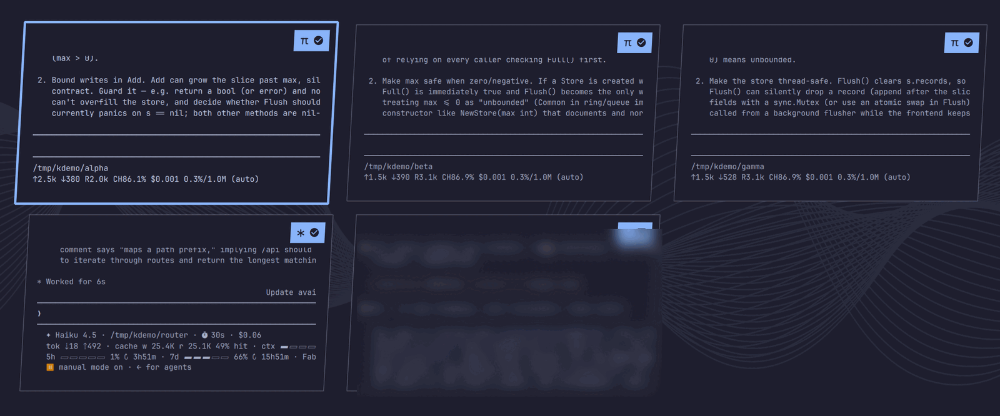

# Kettle

Long-running agent work as simmering pots on your Omarchy bar. Glance to see
what's cooking; get told when something finishes, fails, or needs you. Click a
pot to land in the terminal it's running in.


Sessions come from four sources: **herdr** (every agent it tracks, Pi
included), hooks Kettle installs into **Claude Code, Codex, Qwen Code, Gemini
CLI, Factory droid and Grok Build**, an extension it installs into **pi**,
`kettle-emit` for
[anything else](#any-other-agent), and remote hosts over ssh.

## Why

Agent sessions are long, bursty, and easy to lose track of. You kick one off,
switch workspace, and either forget it or compulsively tab back to check. Worse,
an agent blocked on a permission prompt waits indefinitely while you do
something else.

The state that matters is *finished while you weren't looking* and *waiting on
you right now*. Kettle surfaces exactly those.

## States

| State | Meaning | Ticking clock? |
|---|---|---|
| `simmering` | work in progress | yes — the tick is the signal |
| `needs-attention` | blocked on an approval or question | yes — it's measuring **your** latency |
| `ready` | finished, and you haven't looked yet | no |
| `murky` | agent present but unclassifiable | never shown on the bar |

There is no reachable failure state: neither herdr's statuses nor any hook
carries an exit status, so nothing can tell Kettle a run *failed* rather than
finished. A `burnt` state is reserved for future shell-command pots, which do
report exit codes; mentions of `burnt` below describe that reservation.

A finished pot never ticks — a running counter on stopped work reads as
"still going" — so terminal states show a coarse "just now / 5m ago" plus how
long the run took.

### Colours

Omarchy themes expose five palette roles — `foreground`, `background`, `accent`,
`urgent`, `muted` — and there is no success or warning role. So state is carried
by **glyph first, colour second**: `needs-attention` and `burnt` necessarily
share `urgent` and are told apart by shape and by motion (only
`needs-attention` pulses). That also survives colourblindness, a monochrome
theme, and a 15-pixel bar slot.

## Install

```bash
omarchy plugin add https://github.com/zzwong/omarchy-kettle.git --enable
~/.config/omarchy/plugins/zzwong.kettle/bin/kettle-install
```

Update with `omarchy plugin update zzwong.kettle`; remove with
`omarchy plugin remove zzwong.kettle`.

The second line is separate because Omarchy's installer never executes plugin
code. `kettle-install` merges hook entries into the config of every supported
CLI it finds, in each one's own dialect. It is idempotent, preserves your
existing hooks and settings, and `--remove` reverses it — run that before
`omarchy plugin remove`, which deletes the scripts the hooks point at.
`--check` reports status without changing anything.

herdr needs no setup, and works fully without `kettle-install`; only sessions
outside herdr need the hooks.

## How each source works

**herdr** — polled via `herdr api snapshot` every 2s (backing off to 15s when no
server is running, and waking instantly when the socket reappears). One call
returns every agent, so N sessions cost one process.

A herdr pot is named by, in order: the name from `herdr agent rename`, the
agent's own terminal title (Claude Code sets this to a live task summary),
then the bare agent name. herdr's `done` means *finished while its tab was
unseen* — precisely the state this widget exists to show. Clicking a herdr
pot focuses its tab, which flips it to `idle` and clears the pot on the next
poll: the jump is the acknowledgement.

**Hook-driven agents** — the agent reports its own lifecycle through hooks.
Nothing outside a terminal can observe what happens inside one: OSC escape
sequences flow from the process to the terminal emulator and stop there. The
agent telling you directly is the only honest source of state. The hook
speaks each CLI's dialect (event names, payload casing, timeout units all
differ); one visible consequence: Grok's notification payload is
undocumented, so a Grok permission wait shows as `simmering` rather than a
wrong `ready`.

## pi

pi is the one first-class agent with no hook config to install into — it loads
TypeScript extensions instead. `kettle-install` registers `pi/kettle.ts` by
absolute path in pi's `settings.json`, so `omarchy plugin update` moves the
extension forward the way it does the hook.

The extension does not reimplement the hook. It shells out to
`kettle-agent-hook` with the same payload the Claude and Codex hooks send, so
window identity, session state, and the remote ssh relay all work unchanged.
It reports on `agent_settled` rather than `agent_end`, because pi may still
auto-retry, compact and retry, or run a queued follow-up after `agent_end` —
its own docs point status integrations at the later event.

Before this, a pi session was visible only *inside* herdr, which left the most
ordinary way to run it — `pi` in a terminal — reporting nothing.

pi exposes no event for its own approval prompt, so a pi session waiting on
approval stays `simmering` rather than turning `needs-attention`, the same
compromise Grok Build makes.

## Any other agent

Two paths, neither of which requires changing Kettle.

**Inside herdr, it already works.** herdr detects some twenty agent TUIs and
Kettle renders whatever it reports: a hand-drawn identity mark for most known
agents, an initial in a ring for the rest — never a wrong logo.

**Outside herdr, post events with `bin/kettle-emit`** from whatever extension
point the tool offers — a plugin, a wrapper, a shell alias. This covers tools
with plugin systems instead of hook configs (opencode, Amp), no hooks at all
(goose), or hooks that don't currently fire (Cursor CLI):

```bash
kettle-emit --agent opencode --id "$SESSION" --state working  --cwd "$PWD"
kettle-emit --agent opencode --id "$SESSION" --state blocked  --message "needs approval"
kettle-emit --agent opencode --id "$SESSION" --state finished --model some-model
kettle-emit --agent opencode --id "$SESSION" --state gone
```

States are `register | working | blocked | finished | gone`. `--window`
takes a Hyprland window address as the pot's jump target; without it the pot
is informational. On a host set up by `kettle-remote install`, the same
command posts through the ssh relay instead. `--model` slugs resolve to
display names as described under [Model](#model).

## Jumping to a window

Clicking a pot has to find the right window, which is harder than it sounds.

For herdr, `herdr agent focus <pane>` switches herdr's *internal* tab but does
not raise the OS window, so Kettle follows it with a Hyprland dispatch.

For agent sessions, Kettle uses a trick: OSC 2 (set window title) is the one
escape sequence with an externally visible side effect, because the terminal
republishes the title to the compositor. At session start the hook writes a
nonce title, polls `hyprctl clients` until it appears (~50ms), caches the window
address, and lets the agent repaint its title immediately after.

This matters because single-process terminals — `ghostty --gtk-single-instance`,
`foot --server`, kitty single-instance — report **the same PID for every
window**, so walking the process tree cannot tell them apart. The nonce works
regardless.

### `herdrWindow`

herdr sets no window title of its own, so on a single-process terminal there is
no way to identify its window automatically. Set a title substring:

```json
{ "id": "zzwong.kettle", "herdrWindow": "herdr" }
```

and launch herdr with a matching title, e.g. `ghostty --title=herdr -e herdr`.
On multi-process terminals Kettle finds it automatically and you can leave this
unset.

### `remoteWindow`

The same problem for a remote host's herdr: the window to raise is the local
terminal holding your ssh session. Unset, Kettle matches on the host name,
which works because herdr *does* title that window — `{hostname}: {workspace}`
by default, e.g. `framework: ~`. Set this only if the remote overrides
`window_title` in its herdr config:

```json
{ "id": "zzwong.kettle", "remoteWindow": "my-ssh-tab" }
```

## Model

Each pot names the model beside the agent — `Claude Code · Opus 5`.

Codex and Qwen Code put `model` in the hook payload. Claude Code does not, so
the hook reads the newest assistant message from the last 256 KB of the
session transcript. Gemini, droid and Grok expose it nowhere, so their pots
go without.

Slugs become display names via the model catalogs agents already maintain on
disk (Codex's `models_cache.json`, pi's `models-store.json`), preferring the
emitting agent's own catalog when they disagree. The catalogs are watched
files, so a new model names itself correctly the moment its agent learns it
exists; a capitalisation heuristic covers the rest.

There is no **context-usage readout**: the transcript exposes no
context-window field, and the nearest candidate (`cache_read_input_tokens`)
exceeds the window size after compaction. A number that looks authoritative
and is wrong is worse than no number.

## Keyboard

| Key | Action |
|---|---|
| `↑` `↓` | move the cursor, wrapping at both ends |
| `↵` | jump to the selected pot |
| `Tab` | switch to the adjacent bar panel |
| `Esc` | close |

Hovering a row moves the keyboard cursor to it, so the mouse and the keyboard
can never disagree about what `↵` would do.

Bind the panel itself in `~/.config/hypr/bindings.lua`:

```lua
o.bind("SUPER + SHIFT + T", "Kettle", "omarchy-shell kettle toggle")
```

Stage — a live preview deck of every pot — binds separately:

```lua
o.bind("SUPER + SHIFT + GRAVE", "Kettle Stage", "omarchy-shell kettle stage")
```

It opens on a carousel of the selected pot; `↑` zooms out to a grid of every
pot, `↓` zooms back in (or falls back out of a grid edge into the carousel).



Each slab previews its own session. A hook pot with a resolved window is a
live screencopy of that window; a herdr pane is a text read, because a
screencopy would show whichever tab is visible in the shared window. A pot
with neither is a metadata card.

## Remote hosts over ssh

Agent sessions on another machine appear on your bar, tagged with the host.

```bash
bin/kettle-remote install <host>
bin/kettle-remote test <host>
bin/kettle-remote status <host>
bin/kettle-remote uninstall <host>   # removes the hook and token; reverses install
```

Install mints a per-host token, pushes the hook, wires the remote agent
configs, and probes herdr's absolute path through a login shell. It then
prints an ssh block to add:

```
Host <host>
    RemoteForward 127.0.0.1:47761 /run/user/UID/kettle/kettle.sock
    ControlMaster auto
    ControlPath ~/.ssh/cm-%r@%h:%p
    ControlPersist 10m
```

(`install` prints this block with your real socket path — copy it from
there.) `ControlMaster` makes remote jumps reuse your existing connection
(~48ms rather than ~100ms) and keeps the reverse forward alive after the
session that created it exits.

### How it works, and what it costs

**Remote agents** post events through the reverse forward into the unix socket
the shell already listens on — no daemon, no systemd unit, nothing installed
beyond one hook script. Window identity crosses ssh for free: the hook writes
an OSC 2 title nonce, the terminal republishes the title, and the relay matches
it locally (~400ms).

**Remote herdr** is streamed rather than polled. One long-lived ssh channel per
host runs a loop on the far side that polls herdr's own unix socket — no
crypto, no network — and emits a line only when state changes. Measured: a
per-poll `ssh host herdr api snapshot` costs ~4.5ms of local CPU and wakes the
radio every interval; the channel costs 0ms over 26s and sent one line in 28s.

**Security.** The relay authenticates a per-host bearer token whose *filename*
is the origin host, so a payload can never claim to come from somewhere it
does not. Host, window and focus are always derived locally, never trusted
from the wire. Revoking a host is deleting its token file — which works even
when the host is unreachable. Residual risk, stated plainly: anything running
as your user on the remote can read that token and forge pots for that host.
That is irreducible, because the hook runs as that user.

### Limits

- **No ssh master, no remote herdr pots.** `status` tells you when this is why.
- **Remote herdr pots raise the window by title, not by nonce.** They have no
  OSC nonce, so Kettle matches the terminal holding your ssh session on the
  host name (see [`remoteWindow`](#remotewindow)) rather than knowing its
  window address outright. A detached remote session has no local window and
  focuses the remote pane only.
- **An agent running detached on the remote** (inside remote tmux, or on
  someone else's display) gets an informational pot with no jump target.
- **Remotes must be Linux.** The pushed hook needs bash ≥ 4 and reads
  `/proc`, so a macOS remote's `/bin/bash` 3.2 would fail silently.

## Settings

All three are declared in the manifest, so the shell's widget settings UI
offers them directly; they can also be set by hand on the widget's entry in
`~/.config/omarchy/shell.json`:

| Key | Default | Meaning |
|---|---|---|
| `showCount` | `true` | show the live count beside the glyph |
| `notifications` | `true` | desktop notification on state changes |
| `herdrWindow` | `""` | title/class substring identifying herdr's window |
| `remoteWindow` | `""` | same, for the terminal holding your ssh session; empty matches the host name |

## Notifications

Fire only on transitions into `needs-attention`, `ready`, or `burnt`, and only
when you plausibly cannot already see it. Three guards: focus suppression, a 60s
per-pot cooldown so a flapping agent notifies once a minute rather than once a
flap, and coalescing that turns several near-simultaneous completions into one
summary. The bar always shows true state regardless — notifications are the
escalation, the bar is the truth.

## Testing

```bash
./test/run-tests           # everything
./test/run-tests hook      # one group: structure | coherence | hook | emit |
                           #   install | guard | stream | pimodel | relay
```

No framework, no dependencies beyond bash and python3. The relay group needs a
running shell with the plugin loaded and skips itself cleanly otherwise.

## Requirements

- Omarchy 4 ("Quattro") or newer — the Quickshell plugin architecture
- Hyprland
- Optional: [herdr](https://herdr.dev) and/or any supported agent CLI

## Known limitations

- **herdr `--remote` is not supported.** It relocates the herdr server and
  attaches a local TUI over ssh, but `herdr api snapshot` accepts no arguments —
  the CLI can only query the local socket. Kettle sees nothing.
- **A blocked pot stays amber until the turn ends.** Neither agent emits an
  event when you *approve* a request, so there is nothing to transition on
  short of hooking every tool call.
- **Hook pots do not survive a shell reload.** They live in memory; herdr pots
  repopulate from the next poll, agent pots reappear on their next event.
- **herdr pots show a model only for pi.** The snapshot exposes no model or
  transcript path. pi keys its session logs by working directory — which the
  snapshot does carry — so a local pi pot's model is tail-read from its
  newest session file. Codex keys sessions by date and a Claude cwd can host
  several concurrent sessions, so the same trick would sometimes name the
  wrong one.
- **herdr run durations are accurate to the 2s poll.** Hook-sourced pots are
  exact, so the same work can be reported a second apart by the two sources.

## License

MIT
